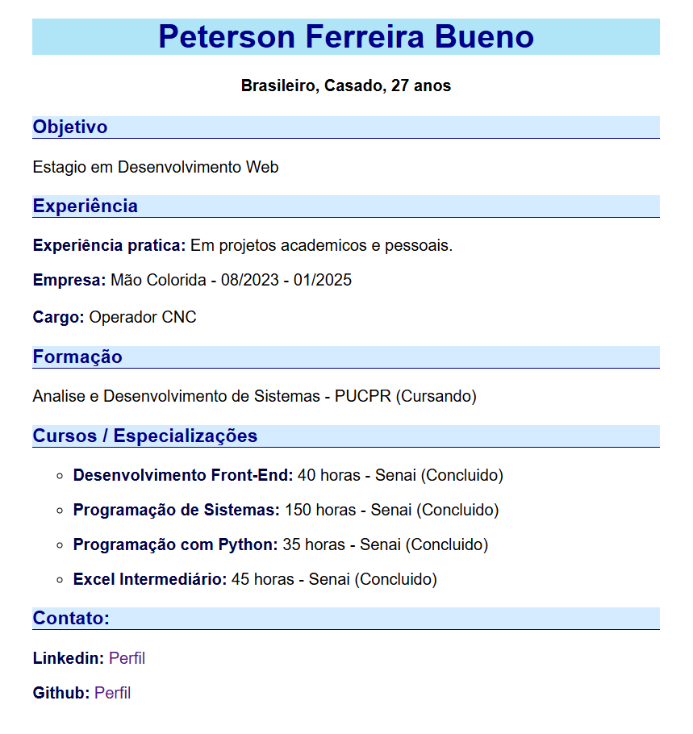

# Desafio Curso Web Fundamentos
#### profº Daniel Tapias

---
- Fiz a estruturação utilizando header, main e footer para organizar de forma semântica o cv, me ajudou muito a solidificar conceitos de SEO.

- Também utilizei tags inline para formatação dos textos.

- Utilizei lista para organizar a aba de cursos.

-  Centralizei o body, definindo width e margin auto

- Utilizei a pseudo-classe 'hover' da tag 'a', para criar um efeito simples.
---

#### Curriculo:

> *()*
